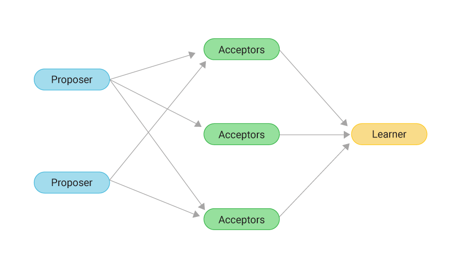

# Paxos

Author: Hugh Signoriello

## About

A fault-tolerant and multithreaded distributed system Java implementation of Leslie Lamport's Paxos algorithm, which aims to reach consensus for a proposed value in a distributed system. Each member can act as one of a Proposer, Acceptor, or Learner for a given election round.

## Assessment

The Paxos implementation is tested under various conditions to ensure its reliability and correctness.

- **Concurrent Proposals**: The system can handle simultaneous voting proposals without conflict, ensuring a single, agreed-upon value is chosen.
  - Test this behaviour with `make test-simultaneous-member-vote`.
- **Immediate Responses**: All members respond without delay, allowing the system to reach a swift consensus.
  - Behaviour is tested by `ImmediateResponseTest` using the command `make test-immediate-response`.
- **Varied Responses**: Members exhibit diverse response patterns, such as immediate, delayed, and no responses. The system is also resilient when proposers like M2 or M3 go offline after proposing.
  - This behaviour is tested by `VariedResponseTest` which can be run with `make test-varied-response`.

Running these tests provides insights into the algorithm's ability to reach consensus under different network conditions and member behaviours. Additionally, `NetworkHandlerTests` examine the communication between servers in a multithreaded environment.

## Getting Started

This document provides instructions for running and testing a fault-tolerant and multithreaded distributed system that implements the Paxos algorithm. The system allows each member to act as a Proposer, Acceptor, or Learner for a given election round.

### Quick Commands

- To run the program: `make run`
- To run all tests: `make test`

## Using the Makefile with Gradle

The included `Makefile` simplifies the process of executing common Gradle commands. Use the commands below to interact with the system.

### Prerequisites

Ensure the following are installed before proceeding:

- Java Development Kit (JDK) compatible with the project.
- Gradle is not required locally; the `Makefile` utilizes the Gradle Wrapper.
- To make the `gradlew` script executable on Unix-like systems, run:

  chmod +x ./gradlew

### Available Commands

- **Default Build**: `make`
  - Builds the project.
- **Explicit Build**: `make build`
  - Compiles the project and builds the distribution.
- **Compile Sources**: `make compile`
  - Compiles Java source files.
- **Clean Build**: `make clean`
  - Cleans the build directory.
- **Run Application**: `make run`
  - Runs the application.
- **Run All Tests**: `make test`
  - Executes all unit tests.
- **Test Concurrent Proposals**: `make test-simultaneous-member-vote`
  - Runs the `SimultaneousMemberVoteTest`.
- **Test Immediate Responses**: `make test-immediate-response`
  - Runs the `ImmediateResponseTest`.
- **Test Varied Responses**: `make test-varied-response`
  - Runs the `VariedResponseTest`.
- **Test Network Communication**: `make test-network`
  - Runs the `NetworkHandlerTest`.
- **Free Ports**: `make kill-ports`
  - Terminates processes on ports 4570-4579.

### Input Format

Nodes are configured using `.csv` files parsed by the `NodeSetupUtils` class in the `Utils` package.

#### Example Input

Each `PaxosNode` is defined with the following format:

address,port,councillor_class,Id,PaxosRole

Sample `.csv` content:

```csv
127.0.0.1,4570,M1,M1,PROPOSER
127.0.0.1,4571,M2,M2,PROPOSER
127.0.0.1,4572,M3,M3,ACCEPTOR
127.0.0.1,4573,M4_9,M4,LEARNER
127.0.0.1,4573,M4_9,M5,LEARNER
127.0.0.1,4573,M4_9,M6,LEARNER
127.0.0.1,4573,M4_9,M7,LEARNER
127.0.0.1,4573,M4_9,M8,LEARNER
127.0.0.1,4573,M4_9,M9,LEARNER
```

## System Design and Architecture

The Paxos system is designed to ensure that distributed systems can reach consensus in the presence of faults. Below is an overview of the system components and the Paxos algorithm as implemented in this project.

## System Components

### PaxosNode

A `PaxosNode` represents an individual member within the Paxos cluster and can take on the role of a Proposer, Acceptor, or Learner. The behaviour is controlled by a `currentRole` flag, which is changed using the `setBehaviour` method to accommodate different rounds in the Paxos algorithm.

### Network Communication

The `NetworkManager` class abstracts the network communication. Each `PaxosNode` includes an instance of `NetworkManager`, ensuring separation of concerns and testability.

### Host Management

`HostList` is a crucial component that maintains a registry of all available hosts within the network, facilitating communication between nodes.

- **Host**: Defines a node with details like address, port, id, and current role. Changes in a node's behaviour are propagated across the system by updating the `HostList`.



### Main Program

- **Entry Point**: The program's entry point illustrates a Paxos sequence. Various sequences and behaviours are explored through tests, with inputs sourced from CSV files within `test/resources`.

- **Council Members**: Defined as `M1` to `M9`, these are classes derived from `PaxosNode` that simulate different behaviours as per councillor specifications.

- **Models Directory**: Contains data structures and types used consistently throughout the system.

- **Unit Tests**: Located within the `test` directory, these tests ensure the reliability and correctness of the application.

### ElectionManager

`ElectionManager` initiates a Paxos round and monitors the progress towards consensus. It starts the election by prompting nodes to prepare a proposal value, triggering the Paxos sequence.

## Councillor Behaviours

### Context

The Paxos system is adapted to simulate an election for the Adelaide Suburbs Council president role. Each councillor (M1 - M9) exhibits unique behaviours:

- **M1**: Highly available with quick responses.
- **M2**: Conditional responses influenced by location affecting latency.
- **M3**: Unreliable node, simulating intermittent connectivity.
- **M4-M9**: Variable response times to reflect average, unpredictable node behaviour.

### Behaviour Modifiers for M2 and M3

- **M2**: Can be adjusted with `setAtCafe`, `setSendDelay`, `setReceiveDelay`.
- **M3**: Uses `setIsCamping` to dynamically alter node behaviour, reflecting varying network conditions.
- **M4-M9**: Random delays introduced to simulate real-world network variability.

## Paxos Algorithm

The Paxos algorithm ensures consensus despite node or network failures. It operates in rounds, with each round consisting of two phases:

### Phase 1a: Proposer - PREPARE

```markdown
A proposer selects a unique and incrementing proposal ID, then sends a PREPARE message.
```

### Phase 1b: Acceptor - PROMISE

```markdown
Acceptors respond to PREPARE messages with a PROMISE, either with or without a previously accepted value, based on the ID.
```

### Phase 2a: Proposer - PROPOSE

```markdown
A proposer, having received a majority of PROMISES, sends a PROPOSE message with a value.
```

### Phase 2b: Acceptor - ACCEPT

```markdown
Acceptors respond to PROPOSE messages by accepting the proposal if the ID matches the highest ID seen.
```

### Consensus

Consensus is reached when a majority of Acceptors agree on a value, which is then learnt by all nodes.

The algorithm's resilience is demonstrated by simulating a variety of network conditions and councillor behaviours.

## Resources

- [Paxos Notes by Prof. Paul Krzyzanowski](https://people.cs.rutgers.edu/~pxk/417/notes/paxos.html)
- [Paxos Made Simple by Leslie Lamport](https://lamport.azurewebsites.net/pubs/paxos-simple.pdf)
